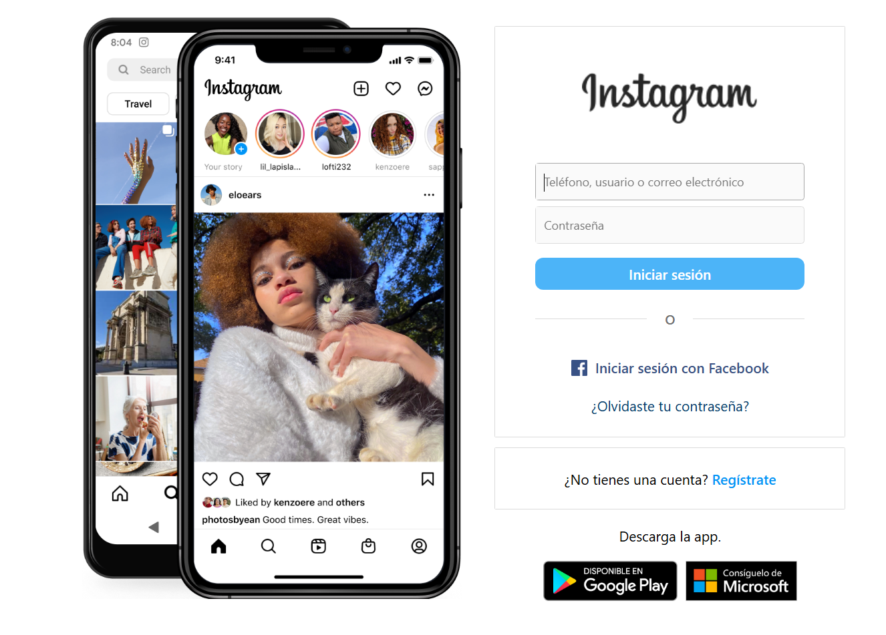
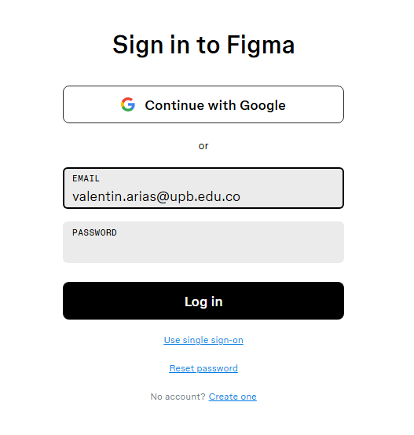
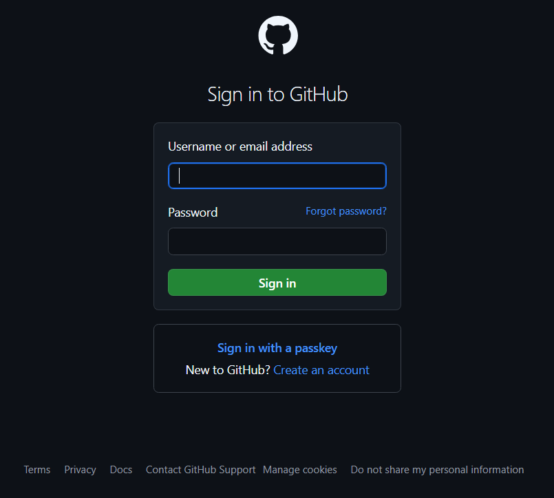

# Rediseño Pagina de inicio SIGAA

## Proceso de diseño

Para empezar a diseñar tome como referencia varios de los diferentes menús de login de diferentes plataformas, comprender los errores de diseño que tiene actualmente el menú de inicio de sesión de SIGAA.

Al revisar estos menús podemos ver que estos se caracterizan por ser lo mayormente compactos posibles, comparados con el menú de SIGAA, que se expande innecesariamente por lo ancho de la pantalla. Otro aspecto que llama bastante la atención es la imagen de fondo, la cual se repite, pues esta no se adapta al tamaño de la pantalla. En cuanto a la estética pienso que no hay mucho que reprochar, pues teniendo en cuenta que esta es una página institucional tiene que guardar una estética formal, y por otro lado, al ser una pagina frecuentemente concurrida, es lo mas óptimo para una navegación favorable. Sin mencionar que deberá de seguir diferentes lineamientos de accesibilidad.

Para empezar a realizar dichos cambios, tengo que recoger los insumos necesarios, tales como colorimetría, logo y background:

* La colorimetría fue sacada del escudo de la universidad, ya que la pagina original si bien utilizaba dichos colores, utilizaba una paleta apagada, contraria a lo que la Universidad busca evocar. Dejando el detalle de las barras inferiores intacto.

* En cuanto al logo utilizado, preferí utilizar el nuevo logo, ya que es un poco extraño ver que dicho logo sea utilizado en todos los espacios tanto físicos como virtuales, mientras que en esta página se siga utilizando el logo anterior.

* En el caso del background fue una tarea un poco difícil, ya que al inspeccionar la página de SIGAA, esta no estaba disponible, por lo que tuve que borrar el bloque de inicio de sesión para tomarle una captura.

En general, fue un cambio más estético que de estructura el realizado, ya que aspectos como los avisos legales considere era importante dejarlos tal cual, visibles y como si fueran mensajes de aviso, ya que estos seguramente serán un apartado legal con el que la Universidad tenga que cumplir.

### Antes

### Despues

## Taller 1

